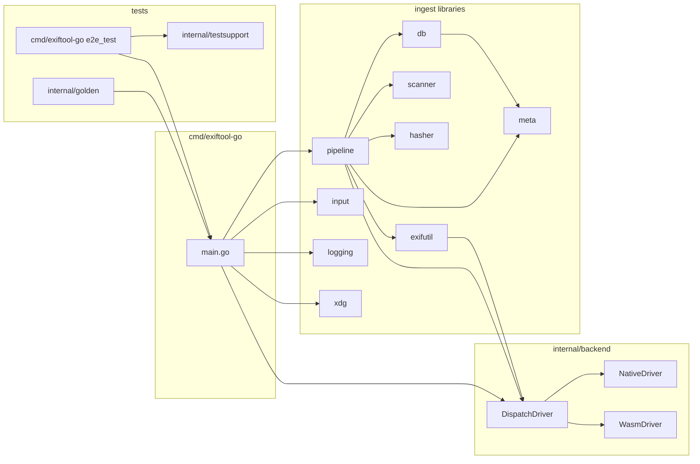
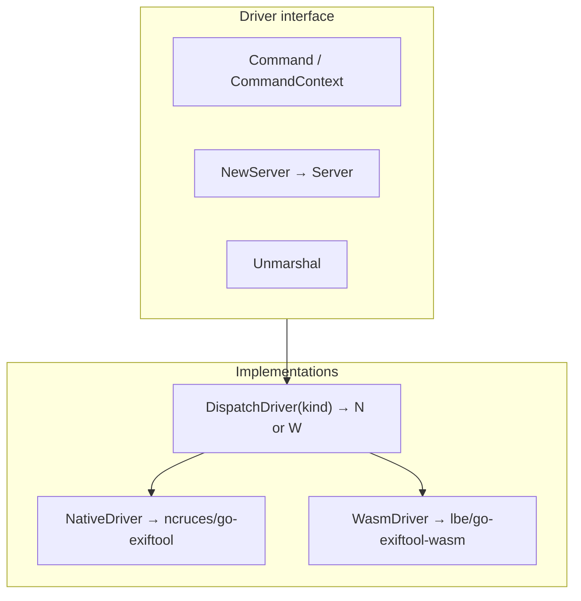
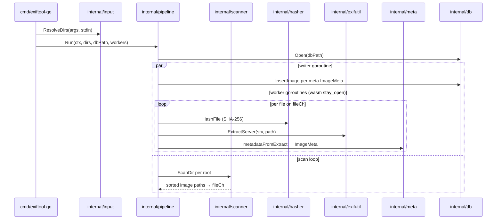

# Architecture: github.com/lbe/exiftool-go

This document describes the **exiftool-go** repository: the `cmd/exiftool-go` CLI (ingest + ExifTool passthrough), shared **`internal/backend`** driver layer, libraries (`pipeline`, `exifutil`, …), and **golden** CLI tests.

Go module: **`github.com/lbe/exiftool-go`** (Go **1.26**).

## Repository map



- **Application code** imports **`internal/backend`** for ExifTool only; it does **not** import `ncruces/go-exiftool` or `lbe/go-exiftool-wasm` directly.
- **`NativeDriver`** and **`WasmDriver`** forward to the upstream modules; **`DispatchDriver`** holds a **`BackendKind`** and delegates to one of them.
- **`internal/meta`** defines **`ImageMeta`** and EXIF status constants shared by **`pipeline`** and **`db`**.

## CLI entry routing (`cmd/exiftool-go/main.go`)

```mermaid
flowchart TD
  A[os.Args] --> H{--help / -help / --version?}
  H -->|yes| U[Print usage or version; exit 0]
  H -->|no| B[StripLeadingBackendFlags]
  B --> P{rest[0] == pipeline?}
  P -->|yes| PF[parseFlags; runIngest]
  P -->|no| F[runForward: DispatchDriver + CommandContext passthrough]
  PF --> LOG[logging.Setup]
  PF --> IN[input.ResolveDirs]
  PF --> XDG[xdg.DataDir → exif.db path]
  PF --> PIPE[pipeline.Run]
```

- **`StripLeadingBackendFlags`** (in **`internal/backend/peel.go`**) removes leading **`--backend=`** / **`--backend`** pairs. If none are present, **`BackendWasm`** is the default for **passthrough**.
- **Ingest:** explicit **`pipeline`** subcommand only → **`internal/pipeline.Run`**. Ingest **always** uses the wasm backend inside **`pipeline`**; the peeled **`--backend`** flag does not affect ingest.
- **Passthrough (default):** all other argv → **`DispatchDriver.CommandContext`** (native or wasm per peeled kind). Subprocess exit codes and stderr are surfaced for native parity (**`exitError`**).
- **Ingest defaults:** log level **`INFO`**; worker count **`runtime.NumCPU()`** (minimum 1).
- **Database path:** **`$XDG_DATA_HOME/exiftool-go/exif.db`**, or **`~/.local/share/exiftool-go/exif.db`** when **`XDG_DATA_HOME`** is unset (**`internal/xdg`**).

## Driver layer (`internal/backend`)



- **`Server`**: stay_open session (**`Close`**, **`Command`**, **`Shutdown`**) — one **`NewServer` per worker** in **`internal/pipeline`** (hardcoded **`BackendWasm`** for ingest).
- **`NativeDriver`**: forwards to ncruces; **`EXIFTOOL_GO_EXIFTOOL`** overrides the Perl driver path (otherwise **`exiftool`** on **`PATH`**).
- **`WasmDriver`**: forwards to wasm; normalizes **warning-only** guest stderr on success paths to match ncruces **`exec`** success semantics.

### Direct dependencies (root `go.mod`)

| Module | Role |
|--------|------|
| `github.com/ncruces/go-exiftool` | Native subprocess ExifTool |
| `github.com/lbe/go-exiftool-wasm` | In-process wasm ExifTool |
| `modernc.org/sqlite` | Ingest database |

Indirect deps include **`lbe/cfsread`**, **`pierrec/lz4/v4`**, etc. Pin versions are authoritative in **`go.mod`**.

## Ingest pipeline (`internal/pipeline`)



- **`internal/scanner`**: walks each root and collects **`.jpg`**, **`.jpeg`**, **`.tif`**, **`.tiff`**, **`.heif`**, **`.heic`**, **`.webp`**, **`.png`** paths in lexical order.
- **`internal/hasher`**: SHA-256 hex digest stored as **`file_hash`**.
- **`internal/exifutil`**: **`Extract`** / **`ExtractServer`** call ExifTool with **`-json`**; **`Extract`** uses **`DispatchDriver(BackendWasm)`** by default. Absolute host paths are passed through to wasm.
- **`metadataFromExtract`** (in **`pipeline.go`**) maps raw EXIF JSON into structured **`meta.ImageMeta`** fields (make/model, GPS, dimensions, exposure, etc.) and sets **`EXIFStatus`**. Hash failures abort the run; EXIF parse failures produce a **`parse_error`** row with empty **`RawEXIF`**.

## Data model (ingest)

- Table: **`images`** (`internal/db/db.go`); SQLite opened with WAL and related pragmas.
- Upsert key: **`file_path`**.
- EXIF status: **`ok`**, **`no_exif`**, **`parse_error`**, **`hash_error`**, **`unsupported`** (constants in **`internal/meta`**; **`hash_error`** is in the schema but the current pipeline aborts on hash failure rather than inserting that status).
- **`exif_json`**: JSON object; empty **`{}`** when EXIF absent or unparsed.
- **`ImageMeta`**: structured fields + **`RawEXIF`**; **`InsertImage`** validates raw vs structured consistency before write.

Primary rich fixture: **`testdata/Metadata_test_file_-_includes_data_in_IIM,_XMP,_and_Exif.jpg`** (+ manifest) for structured + raw contract tests (**`cmd/exiftool-go/e2e_test.go`**, **`internal/testsupport`**).

## Golden CLI tests (`internal/golden`)

- **Dual-backend parity:** **`cli_dual_backend_test.go`** builds **one** **`go build`** of **`./cmd/exiftool-go`**, runs the same argv with **`--backend=native`** vs **`--backend=wasm`**, normalizes output, and compares to **`testdata/golden/*.stdout`** / **`.json`**.
- **Pod matrix:** **`cli_pod_matrix_test.go`** extends the dual-backend table with Pod-aligned argv cases (case rules, option ordering, format flags, etc.).
- **Phase G / T3 / R8:** **`cli_t3_write_original_red_test.go`**, **`phase_g_r8_corpus_red_test.go`**, and related tables share helpers (**`normalize.go`**, **`repo.go`**, **`stable_lines.go`**).
- **Driver-only goldens:** **`version_test.go`**, **`json_jpeg_test.go`**, **`tree_recurse_test.go`** compare pinned ExifTool driver output (native path via **`EXIFTOOL_GO_EXIFTOOL`** or **`PATH`**).
- **Normalization:** **`NormalizeExiftoolJSONGolden`**, **`NormalizeExiftoolTagListText`**, **`NormalizeExiftoolXMLGolden`**, **`NormalizeExiftoolHeadBytes`** drop filesystem-volatile fields before byte comparison (documented in **`testdata/golden/README.md`**).
- Regeneration: **`scripts/exiftoolgen`**, **`internal/golden/cmd/regenjson`**, Makefile **`golden-*`** targets.

## Verification

- **`go test ./...`** — Makefile **`test`** uses **`-count=1 -cover`**; CI (**.github/workflows/go.yml**) sets **`EXIFTOOL_GO_EXIFTOOL`** to a pinned ExifTool **13.55** tree for native-backed rows.
- **`golangci-lint run ./...`** — Makefile **`lint`** target (local/optional; not run in CI workflow).

## Relevant files (non-exhaustive)

| Path | Responsibility |
|------|------------------|
| `cmd/exiftool-go/main.go` | Routing: help, version, backend peel, ingest vs passthrough |
| `cmd/exiftool-go/*_test.go` | Passthrough, reserved argv, routing, backend validation |
| `cmd/exiftool-go/e2e_test.go` | End-to-end ingest against SQLite + rich EXIF fixture |
| `internal/backend/*.go` | **`Driver`**, **`StripLeadingBackendFlags`**, **`ParseBackendLiteral`**, adapters |
| `internal/pipeline/pipeline.go` | Workers, scan, hash, extract, metadata mapping, DB writes |
| `internal/exifutil/exif.go` | JSON extraction via **`Driver`** / **`Server`** |
| `internal/exifutil/serialize.go` | **`SerializeExif`** helper for compact JSON bytes |
| `internal/meta/meta.go` | **`ImageMeta`** and EXIF status constants |
| `internal/hasher/hasher.go` | SHA-256 file hashing |
| `internal/input/input.go` | Directory args + stdin pipe |
| `internal/scanner/scanner.go` | Recursive image discovery |
| `internal/logging/logging.go` | **`slog`** setup for ingest |
| `internal/xdg/xdg.go` | XDG data directory for **`exif.db`** |
| `internal/db/db.go` | SQLite schema, pragmas, upsert, consistency checks |
| `internal/golden/*.go` | CLI goldens vs **`testdata/golden/`** |
| `internal/testsupport/exif_consistency.go` | Shared EXIF/raw JSON assertions for e2e |
| `scripts/exiftoolgen` | Golden regeneration driver |
| `.github/workflows/go.yml` | CI build + test |

The **`/docs`** tree is gitignored in this repository; planning and Tier-5 driver notes may exist locally there but are not part of the tracked source tree.
