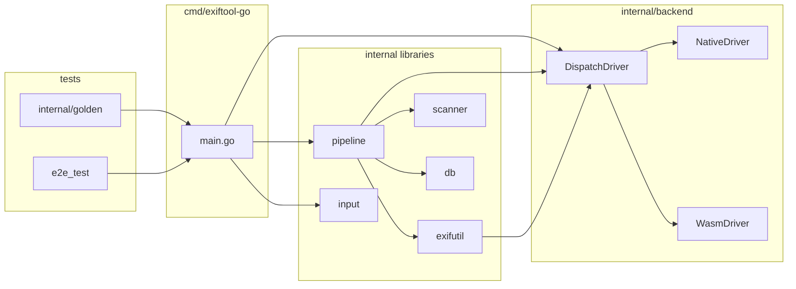
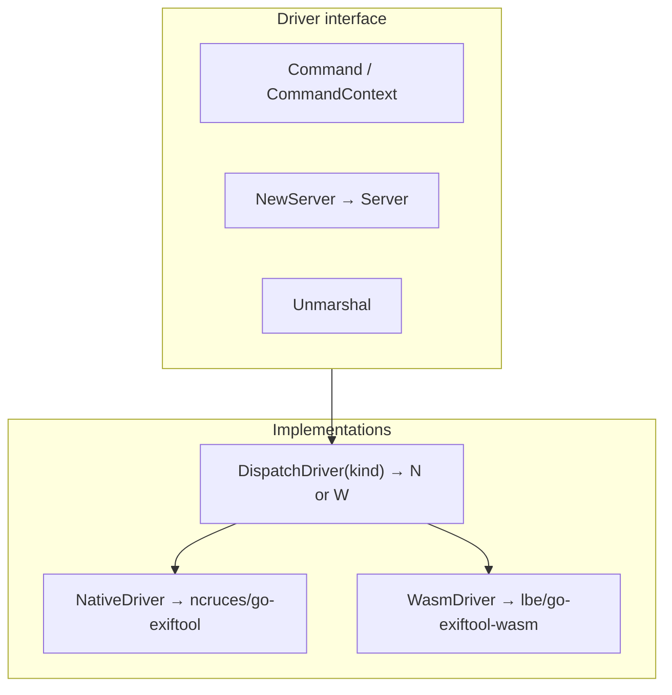
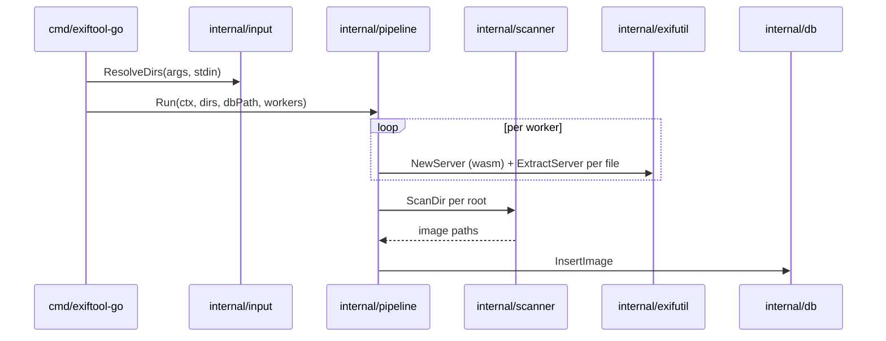

# Architecture: github.com/lbe/exiftool-go

This document describes the **exiftool-go** repository: the `cmd/exiftool-go` CLI (ingest + ExifTool passthrough), shared **`internal/backend`** driver layer, libraries (`pipeline`, `exifutil`, …), and **golden** CLI tests.

## Repository map



- **Application code** imports **`internal/backend`** for ExifTool only; it does **not** import `ncruces/go-exiftool` or `lbe/go-exiftool-wasm` directly.
- **`NativeDriver`** and **`WasmDriver`** forward to the upstream modules; **`DispatchDriver`** holds a **`BackendKind`** and delegates to one of them.

## CLI entry routing (`cmd/exiftool-go/main.go`)

```mermaid
flowchart TD
  A[os.Args] --> H{--help / -help / --version?}
  H -->|yes| U[Print usage or version; exit 0]
  H -->|no| B[StripLeadingBackendFlags]
  B --> P{rest[0] == pipeline?}
  P -->|yes| PF[parseFlags; runIngest]
  P -->|no| L{legacy ingest argv?}
  L -->|yes| PF
  L -->|no| F[runForward: DispatchDriver + CommandContext passthrough]
```

- **`StripLeadingBackendFlags`** (in **`internal/backend/peel.go`**) removes leading **`--backend=`** / **`--backend`** pairs. If none are present, **`BackendWasm`** is the default.
- **Ingest:** `pipeline` subcommand or legacy argv (only `-l` / `--log-level` / `-w` / `--workers` + directory paths) → **`internal/pipeline.Run`**.
- **Passthrough:** all other argv → **`DispatchDriver.CommandContext`** (native or wasm per peeled kind). Subprocess exit codes and stderr are surfaced for native parity (**`exitError`**).

## Driver layer (`internal/backend`)



- **`Server`**: stay_open session (**`Close`**, **`Command`**, **`Shutdown`**) — one **`NewServer` per worker** in **`internal/pipeline`** (default **wasm** for ingest).
- **`WasmDriver`**: forwards to wasm; normalizes **warning-only** guest stderr on success paths to match ncruces **`exec`** success semantics.

### Direct dependencies (root `go.mod`)

| Module | Role |
|--------|------|
| `github.com/ncruces/go-exiftool` | Native subprocess ExifTool |
| `github.com/lbe/go-exiftool-wasm` | In-process wasm ExifTool |
| `github.com/phsym/console-slog` | Logging |
| `modernc.org/sqlite` | Ingest database |

Indirect deps include **`lbe/cfsread`**, **`pierrec/lz4/v4`**, etc. Pin versions are authoritative in **`go.mod`**.

## Ingest pipeline (`internal/pipeline`)



- **`internal/exifutil`**: **`Extract`** / **`ExtractServer`** use **`DispatchDriver(BackendWasm)`** by default; absolute host paths are passed through to wasm after **`go-exiftool-wasm`** path-resolution fixes.

## Data model (ingest)

- Table: **`images`** (`internal/db/db.go`).
- Upsert key: **`file_path`**.
- EXIF status: **`ok`**, **`no_exif`**, **`parse_error`**, **`hash_error`**, **`unsupported`**.
- **`exif_json`**: JSON object; empty **`{}`** when EXIF absent or unparsed.
- **`ImageMeta`**: structured fields + **`RawEXIF`**; insert path validates raw vs structured consistency.

Primary rich fixture: **`testdata/Metadata_test_file_-_includes_data_in_IIM,_XMP,_and_Exif.jpg`** (+ manifest) for structured + raw contract tests.

## Golden CLI tests (`internal/golden`)

- **Dual-backend parity:** one **`go build`** of **`./cmd/exiftool-go`**, same argv, **`--backend=native`** vs **`--backend=wasm`**, normalized output vs **`testdata/golden/*.stdout`** / **`.json`**.
- **Pod matrix / T3 / R8:** additional tables share helpers (**`normalize.go`**, **`repo.go`**).
- Regeneration: **`scripts/exiftoolgen`**, **`testdata/golden/README.md`**, Makefile **`golden-*`** targets.

## Verification

- **`go test ./...`** (CI sets **`EXIFTOOL_GO_EXIFTOOL`** to a pinned ExifTool tree for native-backed rows).
- **`golangci-lint run ./...`** (when enabled locally).

## Relevant files (non-exhaustive)

| Path | Responsibility |
|------|------------------|
| `cmd/exiftool-go/main.go` | Routing: help, version, backend peel, ingest vs passthrough |
| `cmd/exiftool-go/*_test.go` | Passthrough, reserved argv, e2e |
| `internal/backend/*.go` | **`Driver`**, **`StripLeadingBackendFlags`**, **`ParseBackendLiteral`**, adapters |
| `internal/pipeline/pipeline.go` | Workers, scan, hash, extract, DB writes |
| `internal/exifutil/exif.go` | JSON extraction via **`Driver`** |
| `internal/input/input.go` | Directory args + stdin |
| `internal/db/db.go` | SQLite schema and upsert |
| `internal/golden/*.go` | CLI goldens vs **`testdata/golden/`** |
| `scripts/exiftoolgen` | Golden regeneration driver |
| `.github/workflows/go.yml` | CI build + test |

Process and Tier-5 driver policy are maintained in material not tracked in this repository when documentation trees are gitignored.
